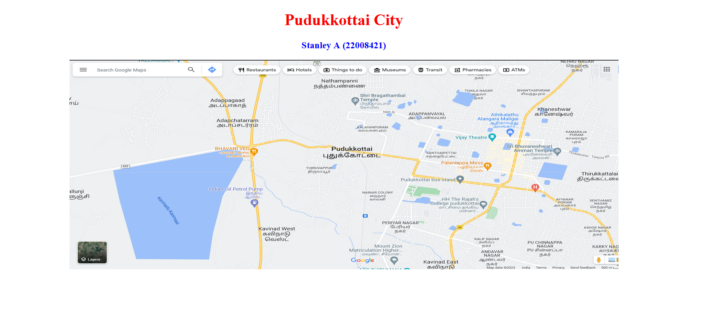
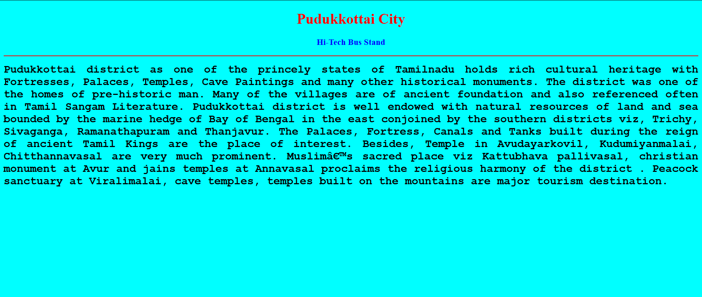
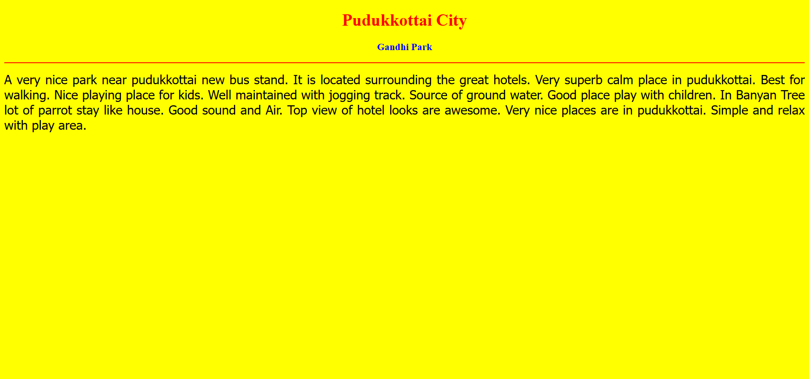
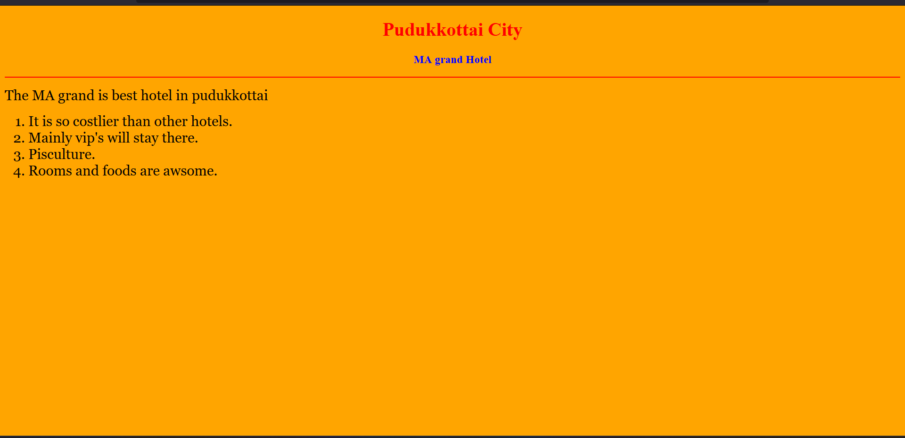
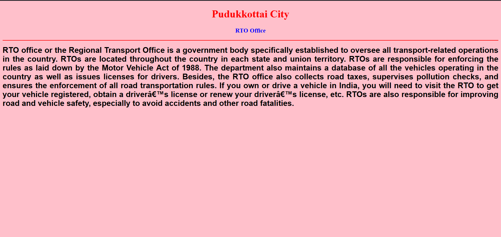
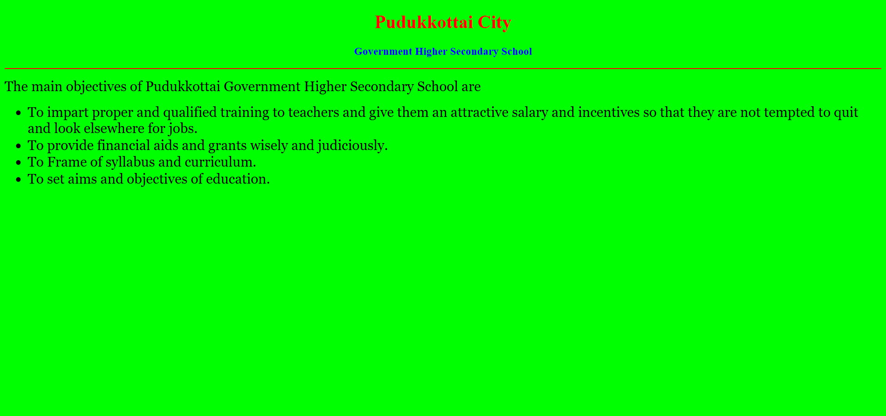
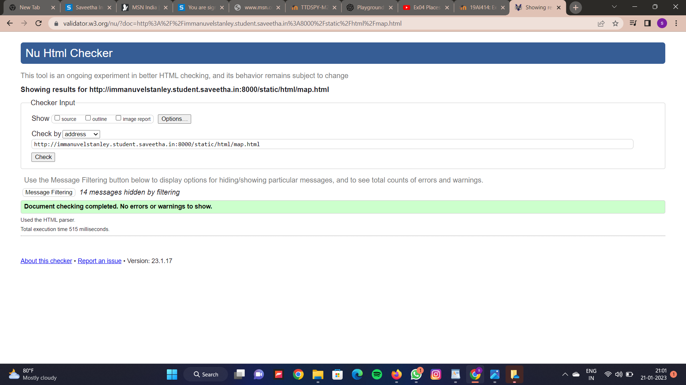

# Places Around Me
## AIM:
To develop a website to display details about the places around my house.

## Design Steps:

### Step 1
Clone the github repository into Theia IDE.
### Step 2:
Create a new Django project.
### Step 3:
Write the needed HTML code.
### Step 4:
Run the Django server and execute the HTML files.
## Code:
```
map.html
<!DOCTYPE html>
<html lang="en">
<head>
<title>My City</title>
</head>
<body>
<h1 align="center">
<font color="red"><b>Pudukkottai City</b></font>
</h1>
<h3 align="center">
<font color="blue"><b>Stanley A (22008421)</b></font>
</h3>
<center>

<map name="MyCity">
<area shape="circle" coords="190,50,20" href="/static/html/ghs.html" title="Govt. Higher Secondary School">
<area shape="rectangle" coords="230,30,260,60" href="/static/html/rto.html" title="RTO Office">
<area shape="circle" coords="400,350,50" href="/static/html/park.html" title="Gandhi park">
<area shape="circle" coords="400,200,75" href="/static/html/bus.html" title="Hi-Tech Bus Stand">
<area shape="rectangle" coords="490,150,870,320" href="/static/html/hotel.html" title="Ma grand">
</map>
</center>
</body>
</html>

bus.html
<!DOCTYPE html>
<html lang="en">
<head>
<title>Bus Stand</title>
</head>
<body bgcolor="cyan">
<h1 align="center">
<font color="red"><b>Pudukkottai City</b></font>
</h1>
<h3 align="center">
<font color="blue"><b>Hi-Tech Bus Stand</b></font>
</h3>
<hr size="3" color="red">
<p align="justify">
<font face="Courier New" size="5">
<b>
Pudukkottai district as one of the princely states of Tamilnadu holds rich cultural heritage with Fortresses, Palaces, Temples, Cave Paintings and many other historical monuments. The district was one of the homes of pre-historic man. Many of the villages are of ancient foundation and also referenced often in Tamil Sangam Literature. Pudukkottai district is well endowed with natural resources of land and sea bounded by the marine hedge of Bay of Bengal in the east conjoined by the southern districts viz, Trichy, Sivaganga, Ramanathapuram and Thanjavur. The Palaces, Fortress, Canals and Tanks built during the reign of ancient Tamil Kings are the place of interest. Besides, Temple in Avudayarkovil, Kudumiyanmalai, Chitthannavasal are very much prominent. Muslim’s sacred place viz Kattubhava pallivasal, christian monument at Avur and jains temples at Annavasal proclaims the religious harmony of the district . Peacock sanctuary at Viralimalai, cave temples, temples built on the mountains are major tourism destination.
</b>
</font>
</p>
</body>
</html>


park.html
<!DOCTYPE html>
<html lang="en">
<head>
<title>Gandhi Park</title>
</head>
<body bgcolor="yellow">
<h1 align="center">
<font color="red"><b>Pudukkottai City</b></font>
</h1>
<h3 align="center">
<font color="blue"><b>Gandhi Park</b></font>
</h3>
<hr size="3" color="red">
<p align="justify">
<font face="Tahoma" size="5">
A very nice park near pudukkottai new bus stand. It is located surrounding the great hotels. 
Very superb calm place in pudukkottai. Best for walking. Nice playing place for kids.
Well maintained with jogging track. Source of ground water.
Good place play with children.  In Banyan Tree lot of parrot stay like house. 
Good sound and Air. Top view of hotel looks are awesome.
Very nice places are in pudukkottai.
Simple and relax with play area.
</font>
</p>
</body>
</html>


hotel.html
<!DOCTYPE html>
<html lang="en">
<head>
<title>MA grand Hotel</title>
</head>
<body bgcolor="orange">
<h1 align="center">
<font color="red"><b> Pudukkottai City</b></font>
</h1>
<h3 align="center">
<font color="blue"><b>MA grand Hotel</b></font>
</h3>
<hr size="3" color="red">
<p align="justify">
<font face="Georgia" size="5">
The MA grand is best hotel in pudukkottai 
<ol type="1">
<li>It is so costlier than other hotels.</li>
<li>Mainly vip's will stay there.</li>
<li>Pisculture.</li>
<li>Rooms and foods are awsome.</li>
</ol>
</font>
</p>
</body>
</html>


rto.html
<!DOCTYPE html>
<html lang="en">
<head>
<title>RTO Office</title>
</head>
<body bgcolor="pink">
<h1 align="center">
<font color="red"><b>Pudukkottai City</b></font>
</h1>
<h3 align="center">
<font color="blue"><b>RTO Office</b></font>
</h3>
<hr size="3" color="red">
<p align="justify">
<font face="Arial" size="5">
<b>
RTO office or the Regional Transport Office is a government body specifically established to oversee all transport-related operations in the country. RTOs are located throughout the country in each state and union territory. RTOs are responsible for enforcing the rules as laid down by the Motor Vehicle Act of 1988.
The department also maintains a database of all the vehicles operating in the country as well as issues licenses for drivers. Besides, the RTO office also collects road taxes, supervises pollution checks, and ensures the enforcement of all road transportation rules. If you own or drive a vehicle in India, you will need to visit the RTO to get your vehicle registered, obtain a driver’s license or renew your driver’s license, etc.
RTOs are also responsible for improving road and vehicle safety, especially to avoid accidents and other road fatalities.
</b>
</font>
</p>
</body>
</html>


ghs.html
<!DOCTYPE html>
<html lang="en">
<head>
<title>Govt. High. Sec. School</title>
</head>
<body bgcolor="lime">
<h1 align="center">
<font color="red"><b>Pudukkottai City</b></font>
</h1>
<h3 align="center">
<font color="blue"><b>Government Higher Secondary School</b></font>
</h3>
<hr size="3" color="red">
<p align="justify">
<font face="Georgia" size="5">
The main objectives of Pudukkottai Government Higher Secondary School are 
<ul>
<li>To impart proper and qualified training to teachers and give them an attractive salary and incentives so that they are not tempted to quit and look elsewhere for jobs.</li>
<li>To provide financial aids and grants wisely and judiciously.</li>
<li>To Frame of syllabus and curriculum.</li>
<li>To set aims and objectives of education.</li>
</ul>
</font>
</p>
</body>
</html>
```


## Output:












## HTML Validator

## Result:

The program for implementing image map is executed successfully